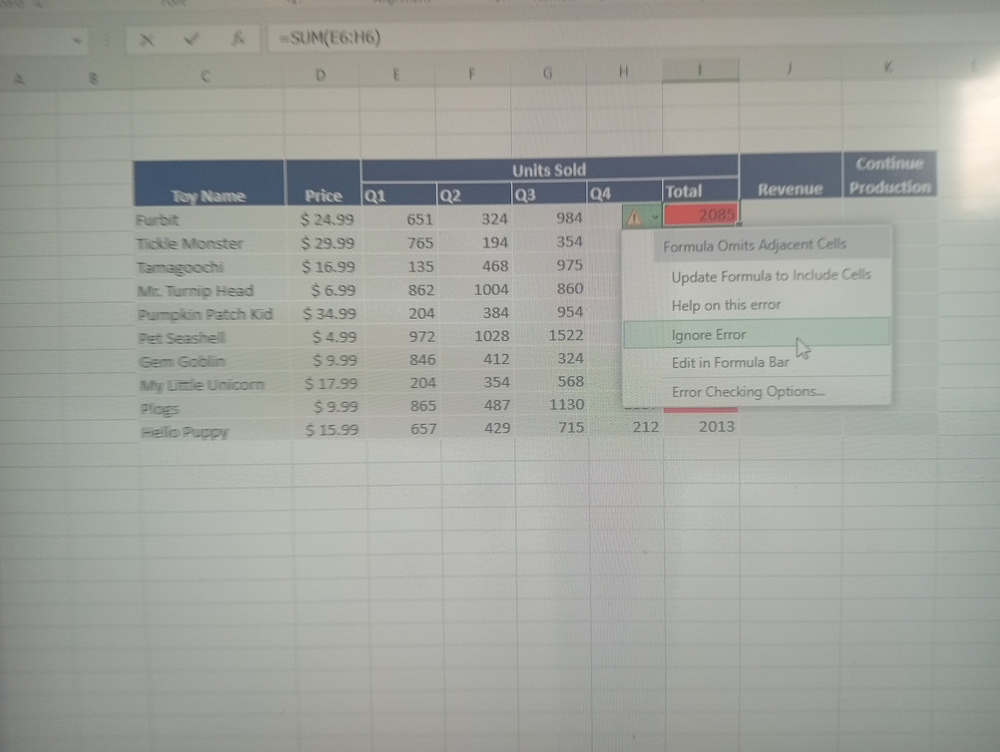

แล็บ 7.4.4
แล็บ 7.4.4: ใช้ข้อมูลตัดสินใจทางธุรกิจ (Use Data to Inform Product Decisions)

### ขั้นตอนที่ 1: ตรวจสอบความถูกต้องของข้อมูล (Investigate Errors)
ในชีทจะมีเครื่องหมายเตือน (สามเหลี่ยมสีเขียว) ขึ้นมา ให้เราไล่เช็คดูทีละจุด
- ถ้าข้อมูลผิดจริง (เช่น ค่าที่ควรเป็นตัวเลขดันเป็นตัวอักษร) ให้รีบแก้ไขให้ถูกต้อง
- ถ้าข้อมูลถูกแล้วแต่ Excel บ่น ให้เลือก **"Ignore Error"** ไปได้เลยครับ

### ขั้นตอนที่ 2: คำนวณรายได้ (Relative References)
เราจะคำนวณรายได้ของ Furbits โดยใช้สูตร: `จำนวนที่ขาย * ราคา`
1. ไปที่เซลล์ **J6**
2. ใส่สูตร `=D6*I6` (หรือตามตำแหน่งคอลัมน์ของไฟล์เรานะ)
3. ใช้ **Fill Handle** (จุดสี่เหลี่ยมมุมขวาล่าง) ลากจาก J6 ลงมาถึง J15 
*เคล็ดลับ: การทำแบบนี้เรียกว่า Relative Reference เพราะ Excel จะเปลี่ยนเลขแถวให้เราอัตโนมัติครับ*

### ขั้นตอนที่ 3: เช็คเกณฑ์การขาย (IF Function & Absolute References)
มาดูว่าของเล่นตัวไหนยอดถึงเป้า (อ้างอิงจาก N5) โดยใช้ IF Function
1. ที่เซลล์ **K6** ให้ใส่สูตร: `=IF(J6>=$N$5, "Yes", "No")`
2. **จุดสำคัญ:** อย่าลืมใส่สัญลักษณ์ `$` หน้า N และ 5 กลายเป็น `$N$5` เพื่อล็อคเซลล์ไว้นะ (Absolute Reference) ไม่งั้นเวลาลากสูตรลงมา ค่าจะเพี้ยน!
3. ลากสูตรจาก K6 ลงมาถึง K15 

