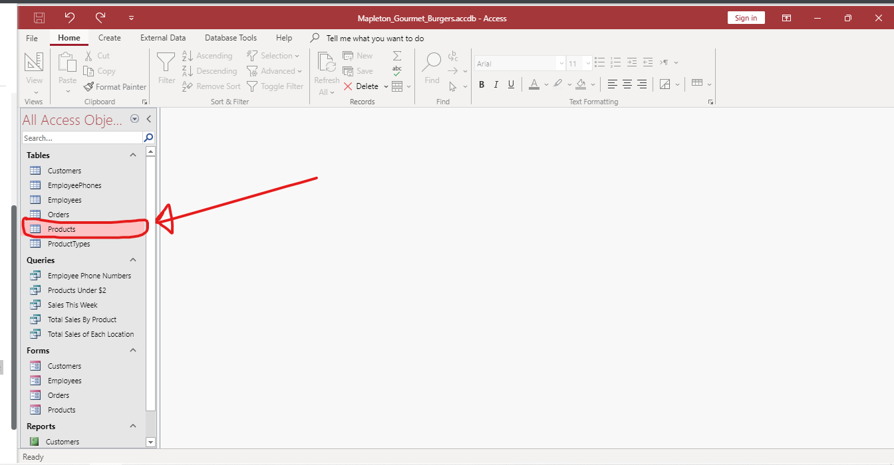
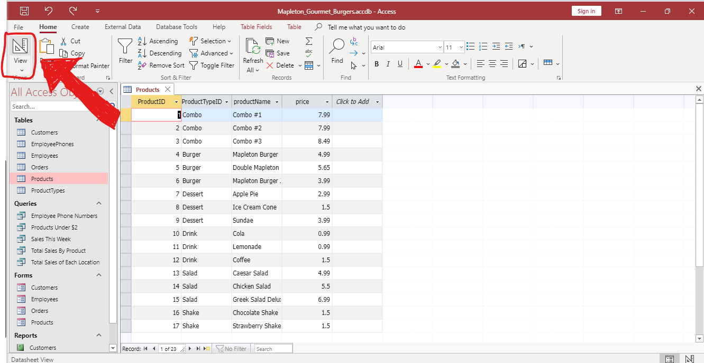
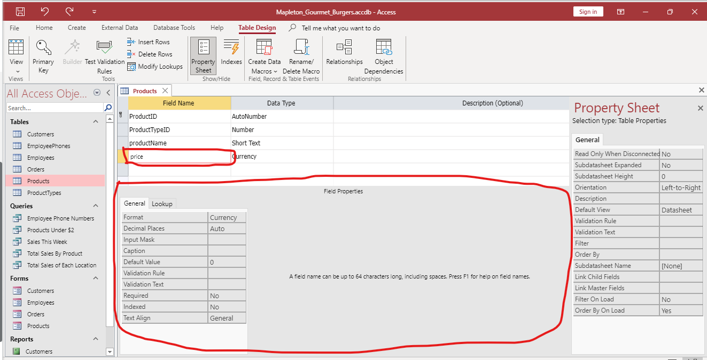
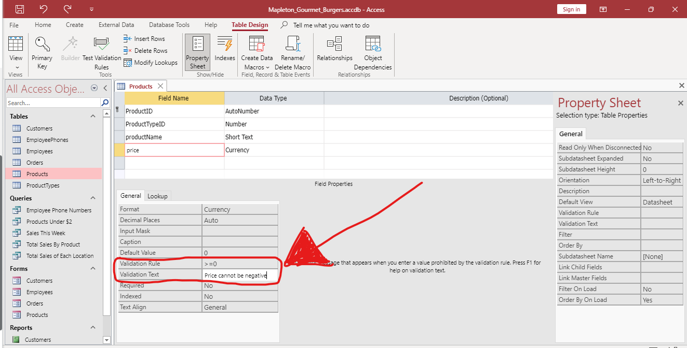
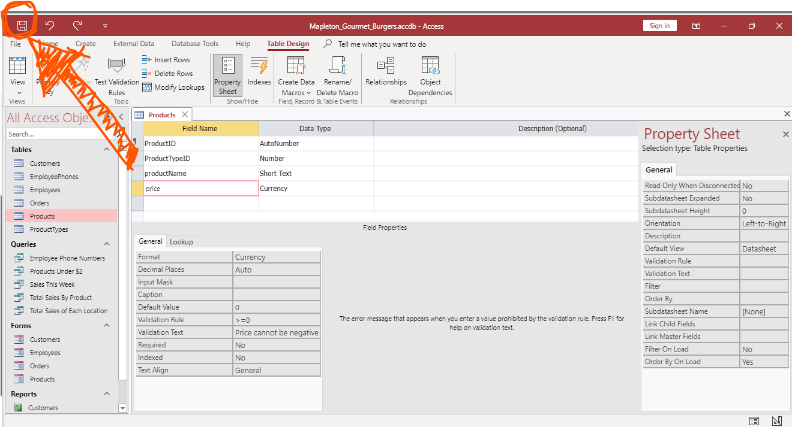

# แล็บ 6.2.3: ป้องกันการกรอกข้อมูลผิดพลาด (Ensure Valid Input) #

## 1. จุดประสงค์ (Objective)
เป้าหมายหลักของการดำเนินการครั้งนี้คือการสร้างความมั่นใจในความถูกต้องและความน่าเชื่อถือของข้อมูล (Data Integrity) ภายในระบบฐานข้อมูลของร้าน โดยเน้นไปที่การป้องกันความผิดพลาดจากการป้อนข้อมูลราคาที่เป็นค่าลบ ซึ่งอาจส่งผลกระทบโดยตรงต่อความแม่นยำทางบัญชีและสถานะทางการเงินของธุรกิจ การตั้งค่านี้จะช่วยควบคุมคุณภาพข้อมูลตั้งแต่จุดเริ่มต้น (Entry Point) เพื่อลดความเสี่ยงจากการทำงานที่ผิดพลาดของระบบในอนาคต

## 2. ขั้นตอนการดำเนินการ (Implementation Steps)
เพื่อให้การบันทึกข้อมูลราคาในตารางสินค้าเป็นไปอย่างถูกต้อง โปรดดำเนินการตามขั้นตอนดังต่อไปนี้:

1. **เปิดตารางข้อมูล Products:** เริ่มต้นโดยการเปิดตาราง **Products** จากแถบนำทาง เพื่อเข้าถึงข้อมูลรายการสินค้าและฟิลด์ราคา (Price)

2. **ปรับเปลี่ยนมุมมองการทำงาน:** ทำการเปลี่ยนไปสู่ **มุมมองออกแบบ (Design View)** โดยคลิกที่ไอคอน **View** บริเวณมุมซ้ายบนของหน้าจอ เพื่อให้สามารถแก้ไขโครงสร้างและคุณสมบัติของฟิลด์ได้

3. **เลือกฟิลด์ที่ต้องการกำหนดค่า:** คลิกเลือกที่ฟิลด์ **price** จากรายการฟิลด์ทั้งหมด เพื่อเข้าถึงแผงคุณสมบัติ (Field Properties) ด้านล่าง

4. **กำหนดเกณฑ์การตรวจสอบและความแจ้งเตือน:** * ในช่อง **Validation Rule** ให้ระบุเงื่อนไข `>=0` เพื่อบังคับให้ข้อมูลที่ป้อนต้องเป็นค่าบวกหรือศูนย์เท่านั้น
   * ในช่อง **Validation Text** ให้ระบุข้อความแจ้งเตือนว่า `Price cannot be negative` เพื่อให้ระบบแสดงข้อความสื่อสารกับผู้ใช้งานเมื่อมีการป้อนข้อมูลผิดเงื่อนไข

5. **บันทึกการเปลี่ยนแปลง:** ทำการคลิกที่ไอคอน **Save** บริเวณมุมซ้ายบนสุด เพื่อจัดเก็บการตั้งค่าทั้งหมดเข้าสู่ระบบฐานข้อมูลอย่างถาวร

## 3. สรุปผล (Summary)
การกำหนดค่าตรวจสอบข้อมูลในครั้งนี้ช่วยยกระดับมาตรฐานความถูกต้องของฐานข้อมูลให้มีความรัดกุมมากยิ่งขึ้น ระบบจะทำหน้าที่เป็นเกราะป้องกัน (Logic Gate) ที่ปฏิเสธการป้อนข้อมูลที่ไร้ความสมเหตุสมผลโดยอัตโนมัติ ส่งผลให้ข้อมูลราคาสินค้ามีความถูกต้องเสมอ ซึ่งเป็นรากฐานสำคัญในการนำข้อมูลไปวิเคราะห์ต่อยอดหรือใช้ร่วมกับระบบปัญญาประดิษฐ์ (AI) เพื่อการทำนายแนวโน้มการขายและบริหารจัดการธุรกิจได้อย่างมีประสิทธิภาพสูงสุด

