# แล็บ 7.4.4: ใช้ข้อมูลตัดสินใจทางธุรกิจ (Use Data to Inform Product Decisions)

## 1. จุดประสงค์ (Objective)
เป้าหมายหลักของการดำเนินการครั้งนี้คือการสวมบทบาทเป็นผู้จัดการผลิตภัณฑ์ (Product Manager) ของบริษัทของเล่น เพื่อทบทวนข้อมูลยอดขายในปีที่ผ่านมา และตัดสินใจเชิงกลยุทธ์ว่าของเล่นชนิดใดควรดำเนินการผลิตต่อไป และชนิดใดควรยกเลิกการผลิต (Discontinued) โดยอ้างอิงจากผลประกอบการที่เกิดขึ้นจริง ผ่านกระบวนการตรวจสอบความถูกต้องของข้อมูล การคำนวณรายได้ และการใช้ฟังก์ชันเงื่อนไขในการประเมินผล

## 2. ขั้นตอนการดำเนินการ (Implementation Steps)
เพื่อให้การวิเคราะห์ข้อมูลเป็นไปอย่างถูกต้องและแม่นยำ โปรดดำเนินการตามขั้นตอนดังต่อไปนี้:

 #### 2.1 ตรวจสอบและแก้ไขข้อผิดพลาดในเวิร์กชีต (Investigate Errors)
  ทำการตรวจสอบแต่ละ Error ที่แสดงในตาราง หากพบปัญหาจริงให้ทำการแก้ไข แต่หากเป็นเพียงการแจ้งเตือนจากระบบให้เลือก Ignore Error โดยมีรายละเอียดดังนี้:

  จุดที่ 1: สูตรการคำนวณในเซลล์ I6 คือ =SUM(E6:H6) ถูกต้องแล้ว ไม่ได้มีข้อผิดพลาด

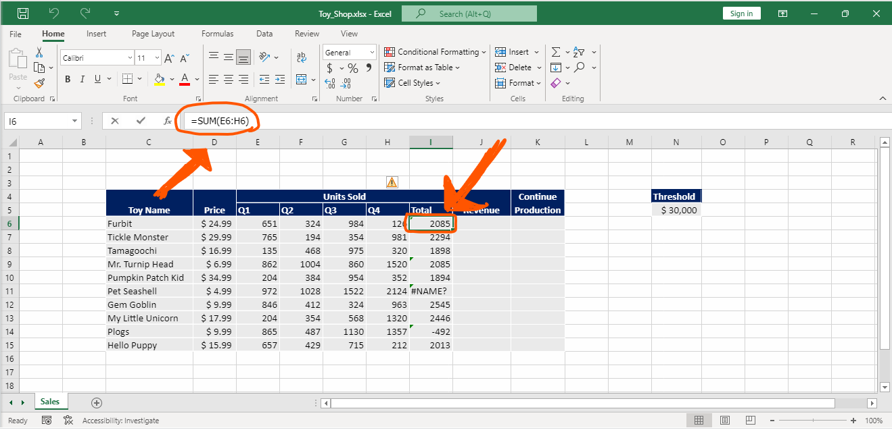

  ให้คลิกที่ไอคอนแจ้งเตือนสีเหลืองแล้วเลือก Ignore Error

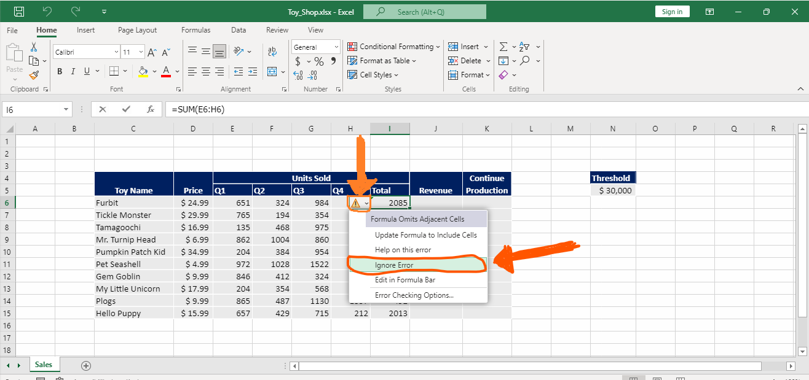

  จุดที่ 2: เกิดจากการระบุหมายเลขแถวในสูตรผิดพลาด (อ้างอิงข้ามแถว) 

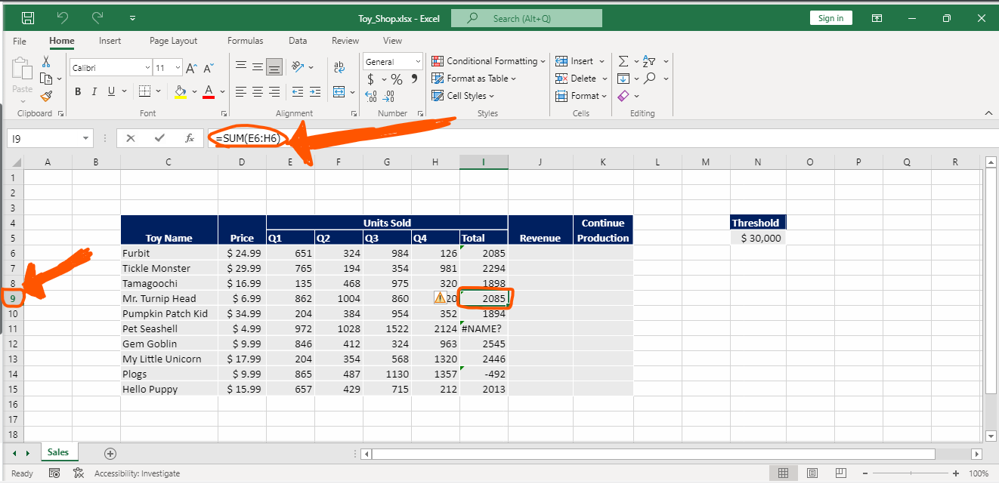

  ให้แก้ไขตัวเลขแถวในสูตรเซลล์ I9 ให้ตรงกับแถวของข้อมูลสินค้า ณ ปัจจุบัน โดยพิมพ์สูตรเป็น =SUM(E9:H9)

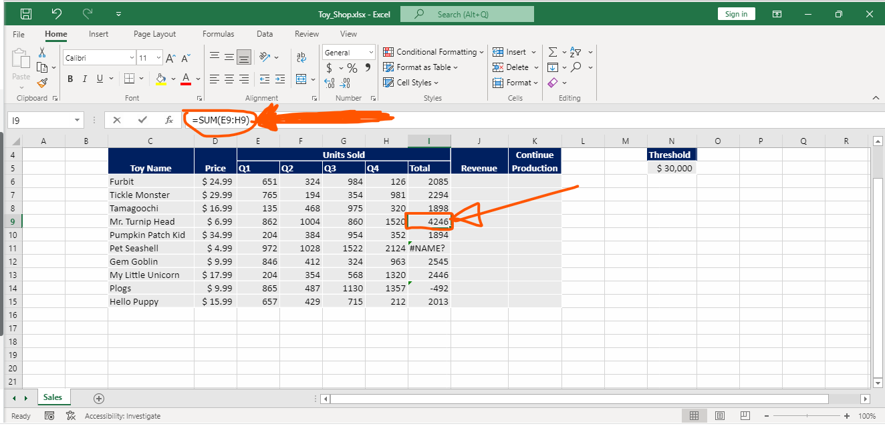

  จุดที่ 3: เกิดจากการระบุชื่อฟังก์ชันผิด โดยในสูตรใช้คำว่า TOTAL ซึ่งไม่มีอยู่จริงในระบบ 

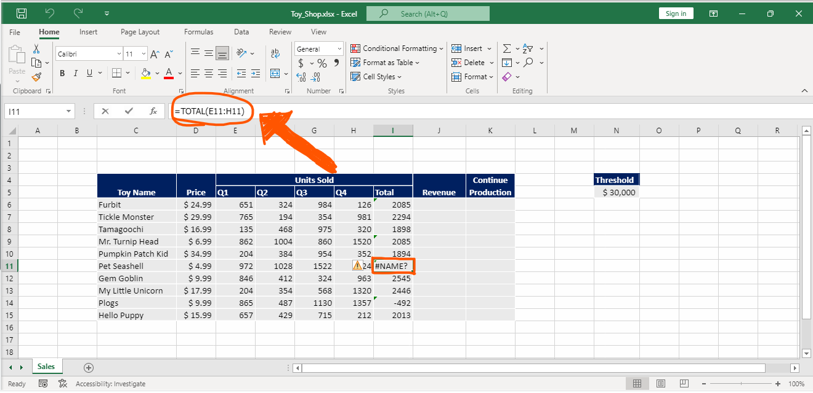

  ให้ทำการแก้ไขสูตรในเซลล์ I11 โดยเปลี่ยนจาก TOTAL เป็นฟังก์ชัน SUM ได้เป็น =SUM(E11:H11)

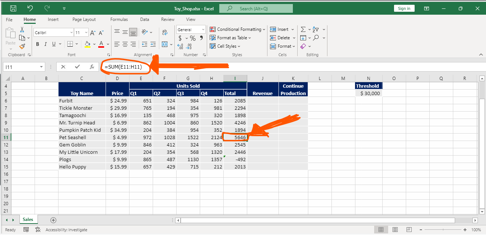

  จุดที่ 4: เกิดจากการใช้เครื่องหมายผิดประเภท ปกติระหว่างชื่อเซลล์เพื่อระบุช่วงข้อมูลจะต้องใช้เครื่องหมายทวิภาค (Colon :) แต่ในสูตรนี้ถูกพิมพ์เป็นเครื่องหมายลบ (-) ทำให้ค่าที่ออกมาติดลบ 

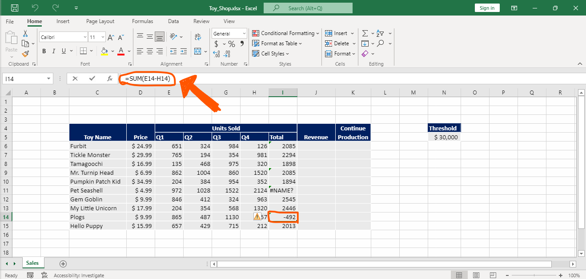

  ให้ทำการแก้ไขสูตรในเซลล์ I14 โดยเปลี่ยนจากเครื่องหมาย - เป็น : ได้เป็น =SUM(E14:H14)

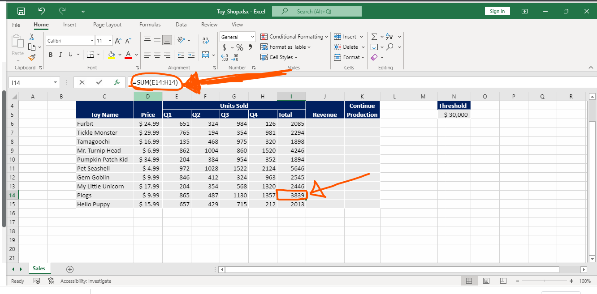

 #### 2.2 การคำนวณรายได้รวม (Calculate Revenue)
  คลิกที่เซลล์ J6

  สร้างสูตรโดยใช้ Relative References เพื่อคำนวณมูลค่ารวม โดยพิมพ์สูตร =D6*I6

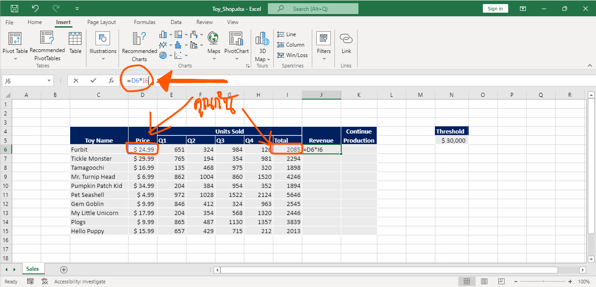

  สูตรนี้คือการนำจำนวนที่ขายได้ทั้งหมด (Total units sold) คูณกับ ราคา (Price) ของ Furbits

  เมื่อได้ผลลัพธ์แล้ว ให้ใช้ Fill handle (จุดมุมขวาล่างของเซลล์) ลากคัดลอกสูตรจาก J6 ลงไปจนถึง J15

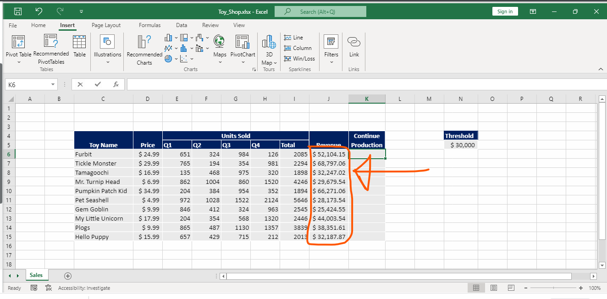

 #### 2.3 การประเมินสถานะการผลิต (Evaluate Production Status)
 
  คลิกที่เซลล์ K6

    ใช้ฟังก์ชัน IF สร้างสูตรเพื่อประเมินผล โดยพิมพ์สูตร =IF(J6>=$N$5, "Yes", "No")

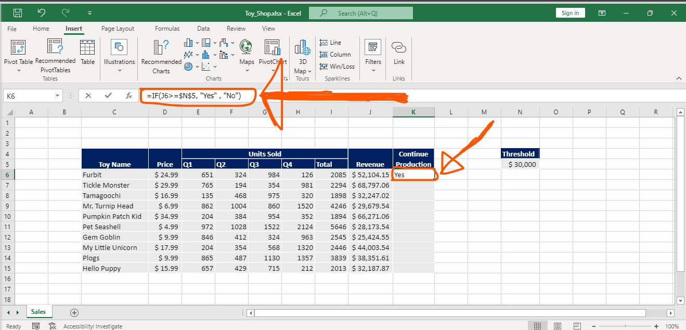

    สูตรนี้เป็นการกำหนดเงื่อนไขว่า: จะแสดงผลเป็นคำว่า Yes ถ้ารายได้จาก Furbits (ในคอลัมน์ J) มีค่า มากกว่าหรือเท่ากับ ค่าเกณฑ์ (Threshold) ที่ตั้งไว้ในเซลล์ N5 และจะแสดงผลเป็นคำว่า No หากรายได้มีค่าน้อยกว่า
  
    ข้อควรระวัง: ในการอ้างอิงเซลล์ N5 จะต้องใช้ Absolute Reference (เช่น $N$5) เพื่อล็อกตำแหน่งเซลล์ไว้ ไม่ให้เคลื่อนที่เมื่อทำการคัดลอกสูตร
   
    เมื่อสูตรเสร็จสมบูรณ์ ให้ใช้ Fill handle ลากคัดลอกสูตรจาก K6 ลงไปจนถึง K15

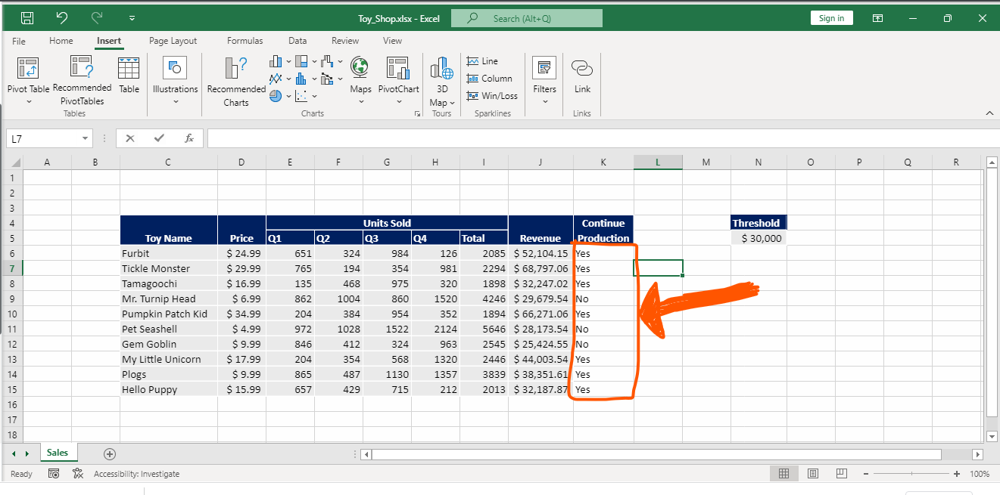

  #### 2.4. อย่าลืมที่จะเซฟงานทุกรอบ เพื่อป้องกันไฟล์สูญหาย
  
## 3. สรุปผล (Summary)
การดำเนินการใน Lab นี้ช่วยให้บริษัทสามารถทำความสะอาดข้อมูล (Data Cleansing) ได้อย่างมีประสิทธิภาพด้วยการไล่ตรวจสอบและแก้ไขข้อผิดพลาดทางไวยากรณ์ (Syntax) ของสูตรต่างๆ นอกจากนี้ การประยุกต์ใช้สูตรคณิตศาสตร์ร่วมกับฟังก์ชันเงื่อนไข (Logical Function - IF) ยังช่วยให้ระบบสามารถประเมินประสิทธิภาพของสินค้าแต่ละรายการเทียบกับเกณฑ์ที่กำหนดไว้ได้อย่างอัตโนมัติ ข้อมูลที่ได้ในคอลัมน์ Continue Production จะกลายเป็นตัวชี้วัดที่ชัดเจนและปราศจากอคติ ช่วยให้ผู้บริหารสามารถตัดสินใจได้ทันทีว่าควรจัดสรรทรัพยากรไปลงทุนกับของเล่นชิ้นใดต่อเพื่อสร้างผลกำไรสูงสุดให้กับธุรกิจ     

[🏠 กลับหน้าหลัก](README.md)
